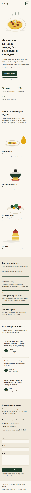
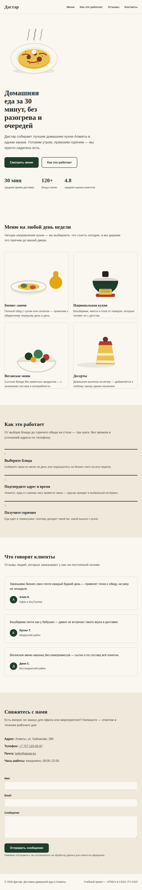
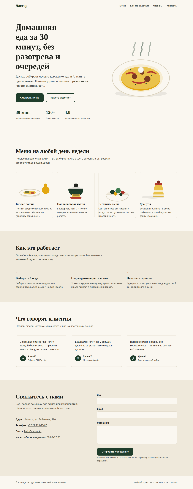

# Дастар — доставка домашней еды (лендинг)

**Тема:** доставка еды
**Автор:** Омаров Нурислам
**Группа:** IT1-2310

## Ссылка на сайт

https://<login>.github.io/landing-omarov/

*(замените `<login>` на свой логин GitHub после публикации через GitHub Pages)*

## Что сделано

Одностраничный лендинг сервиса доставки домашней еды «Дастар» на чистом HTML5 и CSS3, без шаблонов и CSS-фреймворков.

- **Семантическая разметка:** `header`, `nav`, `main`, `section`, `article`, `footer`, `address`.
- **6 смысловых блоков:** шапка с навигацией, hero-секция, меню (4 карточки), «Как это работает» (3 шага), отзывы клиентов, форма обратной связи с контактами.
- **Форма обратной связи:** поля «Имя», «Email», «Сообщение» — у каждого есть `<label>` и атрибут `required`.
- **Доступность:** атрибуты `alt` у всех изображений, `aria-label` у навигации и кнопки меню, видимый фокус при навигации с клавиатуры, мобильное меню реализовано без JavaScript (чекбокс-переключатель на чистом CSS).
- **SEO/head:** `title`, `meta description`, `meta viewport`, favicon (SVG), заголовки `h1`–`h3` в логической иерархии.
- **Адаптивность:** проверено на ширине 375px (мобильные) и 1280px (десктоп), с промежуточными точками для планшетов.
- **Изображения:** собственные SVG-иллюстрации в папке `images/` (без внешних фото и стоков).

## Структура проекта

```
landing-omarov/
├── index.html
├── css/
│   └── style.css
├── images/
│   ├── hero.svg
│   ├── menu-lunch.svg
│   ├── menu-national.svg
│   ├── menu-vegan.svg
│   ├── menu-dessert.svg
│   └── favicon.svg
└── README.md
```

## Как запустить локально

Открыть `index.html` в браузере — сборка и сервер не требуются.

---

## Лаба 3 — трек D: современный чистый CSS

Без препроцессора и без фреймворка. Использованы следующие возможности из четырёх (по заданию нужно минимум две):

- **CSS Nesting** — вложенные селекторы прямо в обычном CSS, без Sass. Используется в `.btn`, `.site-header`, `.main-nav`, `.menu-card` (см. `css/style.css`).
- **Container Queries** — сетка карточек меню (`#menu`) реагирует на ширину своего контейнера, а не всего экрана: 1 карточка в ряд по умолчанию, 2 при ширине контейнера от 600px, 4 — от 1024px. Это прямая замена media-запросам/Sass-миксинам для конкретного компонента.
- **`clamp()`** — плавный (fluid) размер шрифта у заголовков (`h1`, `h2`) и у всего текста в `body`, без ступенек через media-запросы.
- **`:has()`** — шапка сайта (`.site-header`) сама подсвечивается тенью, когда открыто мобильное меню (`:has(.nav-toggle-input:checked)`), без единой строчки JavaScript.

### Почему этот инструмент

Чистый CSS в 2026 году закрывает почти все задачи, для которых раньше был нужен Sass или фреймворк. Nesting убрал повторение родительского селектора и сделал файл читаемым как вложенная структура, а не плоский список правил. Container queries оказались удобнее media-запросов там, где элемент переиспользуется в разных местах страницы — компонент подстраивается под свой контейнер, а не гадает про весь экран. `clamp()` избавил от трёх-четырёх строк с разными `font-size` под разные ширины — одна строка вместо кучи правил. Из минусов: `:has()` и container queries пока не работают в очень старых браузерах, и для критичных проектов пришлось бы делать fallback. Также без препроцессора нет переменных на уровне SCSS (циклов, функций) — но для одной лендинг-страницы это не критично, а CSS-переменные в `:root` покрывают большую часть потребности в переиспользуемых значениях. По сравнению с Tailwind (трек A) здесь разметка остаётся чистой, без длинных цепочек классов; по сравнению с Bootstrap (трек B) — нет лишнего веса неиспользуемых компонентов; по сравнению с Sass+BEM (трек C) — не нужен отдельный шаг сборки, GitHub Pages отдаёт файл как есть.

### Адаптив

Проверено на трёх ширинах, скриншоты — в папке `screenshots/`:

| 375px (телефон) | 768px (планшет) | 1280px (десктоп) |
|---|---|---|
|  |  |  |

На телефоне меню сворачивается в бургер (чекбокс-переключатель на чистом CSS, без JS), карточки меню — в один столбец. На планшете меню полностью развёрнуто, карточки — по 2 в ряд. На десктопе карточки — по 4 в ряд. Горизонтальной прокрутки нет ни на одной ширине.

### Использование ИИ

Claude (Anthropic) использовался для генерации структуры страницы, стилей, SVG-иллюстраций и адаптации под требования трека D (nesting, container queries, `clamp()`, `:has()`).
